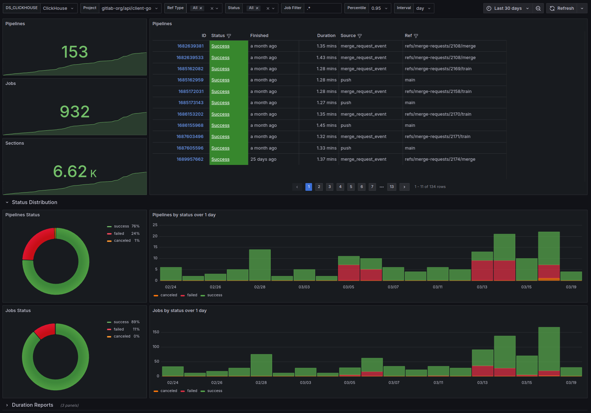

# gitlab-exporter

`gitlab-exporter` can help you build an observability and analytics solution to
gain insights into your CI pipelines.

It fetches data from the [GitLab API][gitlab-api] and sends it to one or more
_recorders_. These recorders then can store it in a datastore of their choosing.

The communication between the exporter and recorders is defined as a [gRPC]
service using [protocol buffers][protobuf] where the exporter acts as a client
and the recorders implement the server interface. This allows the data to be
flexibly stored in various storage backends.


### Recorders

The following officially supported recorder implementations are currently available:

- [gitlab-exporter-clickhouse-recorder](https://gitlab.com/gitlab-exporter/clickhouse-recorder)

### Screenshots

These screenshots are taken from Grafana dashboards available
[here](https://gitlab.com/gitlab-exporter/grafana-dashboards).

<details>
    <summary>Projects / Pipelines / Overview </summary>
    
    
</details>

<details>
    <summary>Projects / Pipelines / Details</summary>
    
    
</details>

<details>
    <summary>Projects / Jobs / Details</summary>
    
    
</details>

<details>
    <summary>Projects / Test Reports / Overview</summary>
    
</details>

<details>
    <summary>Projects / Merge Requests</summary>
    
    
</details>

<details>
    <summary>Projects / DORA</summary>
    
</details>

## Getting started

Please have a look at the [demo](https://gitlab.com/gitlab-exporter/demo)
project which provides a `docker compose` based setup to help you get started.

## Installation

### Binaries

To install `gitlab-exporter` you can download a 
[prebuilt binary][prebuilt-binaries] that matches your system, e.g.

```shell
# download latest release archive
RELEASES_URL=https://gitlab.com/api/v4/projects/gitlab-exporter%2Fgitlab-exporter/releases
RELEASE_TAG=$(curl -sSfL ${RELEASES_URL} | jq -r '.[0].tag_name')
curl -sSfL ${RELEASES_URL}/${RELEASE_TAG}/downloads/gitlab-exporter_${RELEASE_TAG}_linux_amd64.tar.gz \
    -o /tmp/gitlab-exporter.tar.gz

# extract executable binary into install dir (must exist)
INSTALL_DIR=$HOME/.local/bin
tar -C ${INSTALL_DIR} -zxof /tmp/gitlab-exporter.tar.gz gitlab-exporter

# check
${INSTALL_DIR}/gitlab-exporter version
```

### Docker

```shell
docker run --rm registry.gitlab.com/gitlab-exporter/gitlab-exporter:latest
```

### Helm

If you want to deploy on [Kubernetes](http://kubernetes.io) there is a
[Helm](https://helm.sh) chart you can use:

```shell
helm pull oci://registry.gitlab.com/gitlab-exporter/helm-charts/gitlab-exporter
```

## Usage

`gitlab-exporter` can either run in daemon mode or execute one-off
commands.

### Daemon Mode

To run `gitlab-exporter` in daemon mode use:

```shell
gitlab-exporter run --config CONFIG_FILE 
```

This will periodically fetch data of the configured projects and send it to a
list of recorders.
See [Configuration](#configuration) for configuration options.

### Command Mode

`gitlab-exporter` supports a number of commands that can be executed
individually. Use the following to get an overview of available commands:

```shell
gitlab-exporter -h
```

## Configuration

Configuration options can be specified in a config file that is passed to the
application using the `--config` command-line flag.

For an overview of available configuration options and their default values,
see [configs/gitlab-exporter.yaml](./configs/gitlab-exporter.yaml).

Some options can also be overriden with command-line flags and/or environment
variables, where flags take precedence.

| Flag             | Environment Variable | Default Value          |
| ---              | ---                  | ---                    |
| # global options |                      |                        |
| --gitlab-url     | `GLE_GITLAB_URL`     | `"https://gitlab.com"` |
| --gitlab-token   | `GLE_GITLAB_TOKEN`   | **required**           |
| # run options    |                      |                        |
| --log-level      | `GLE_LOG_LEVEL`      | `"info"`               |
| --log-format     | `GLE_LOG_FORMAT`     | `"text"`               |

## Acknowledgements

This project was inspired by Maxime Visonneau's
[gitlab-ci-pipeline-exporter](https://github.com/mvisonneau/gitlab-ci-pipelines-exporter).

## License

This project is licensed under the [MIT License](./LICENSE).

[protobuf]: https://protobuf.dev/
[grpc]: https://grpc.io/
[gitlab-api]: https://docs.gitlab.com/ee/api/rest/
[prebuilt-binaries]: https://gitlab.com/gitlab-exporter/gitlab-exporter/-/releases
